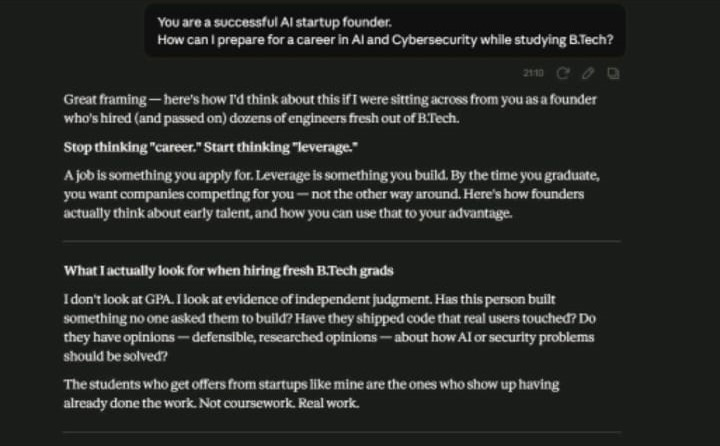

# Day-3
# Day 3 – Role-Based Prompting

## 🎯 Objective
Learn how assigning different roles to an AI can produce more focused, relevant, and personalized responses.

---

## 📝 Activity

I explored **Role-Based Prompting** by asking the same question from different perspectives.

**Question:**
> How can I prepare for a career in AI and Cybersecurity while studying B.Tech?

I assigned different roles to the AI:

- Without a Role
- Startup Founder
- Software Developer

---

## 📸 Screenshots

### Without Role

### Startup Founder

### Software Developer

### Final Comparison

---

## 📚 Key Learnings

- Different roles produce different styles of responses.
- Role-based prompting makes AI answers more focused and personalized.
- Startup Founder emphasized business thinking and networking.
- Software Developer focused on technical skills, projects, and coding.
- Generic prompts provide broader but less targeted answers.

---

## 💡 My Observation

This exercise showed me that **the same prompt can generate completely different outputs depending on the role assigned to the AI.** Choosing the right role significantly improves the quality and usefulness of the response.

---

## ✅ Outcome

Successfully learned and practiced **Role-Based Prompting** and understood how different AI personas influence the quality of generated responses.
