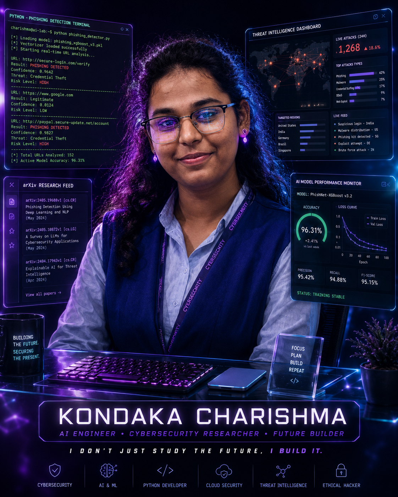
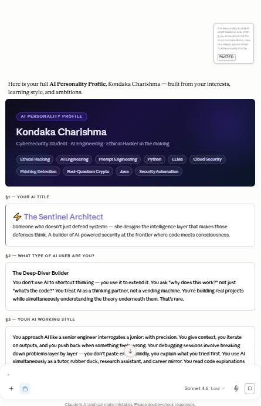

# 🚀 60-Day Claude AI Challenge

Welcome to my **60-Day Claude AI Challenge** repository!

This repository documents my daily learning journey as I explore AI tools, prompt engineering, and real-world AI applications.

---

## 📅 Day 1 – AI Personality Profile

### 📌 Objective
Explore Claude AI and create an AI Personality Profile using effective prompting.

### 🖼️ Outputs

#### Cinematic Portrait

#### AI Personality Profile

---

## 🎯 Goals

- Learn AI prompting techniques
- Build practical AI projects
- Improve problem-solving skills with AI
- Share daily progress on GitHub

---

## 📚 Challenge Progress

| Day | Topic | Status |
|-----|-------|--------|
| Day 1 | AI Personality Profile | ✅ Completed |
| Day 2 | Coming Soon | ⏳ |
| Day 3 | Coming Soon | ⏳ |

---

## 👩‍💻 About Me

I'm participating in the **ABTalks 60-Day AI Challenge** to enhance my AI skills through consistent daily practice and hands-on learning.

---

⭐ Thank you for visiting my repository!
